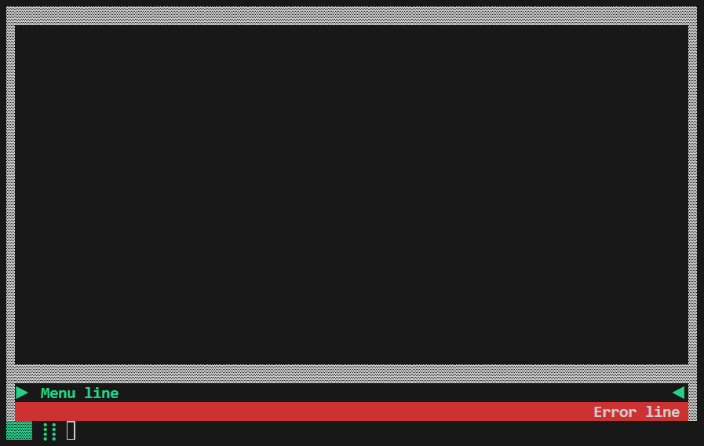
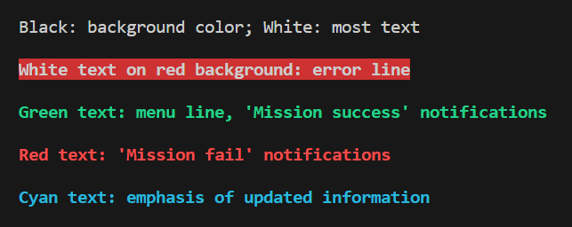
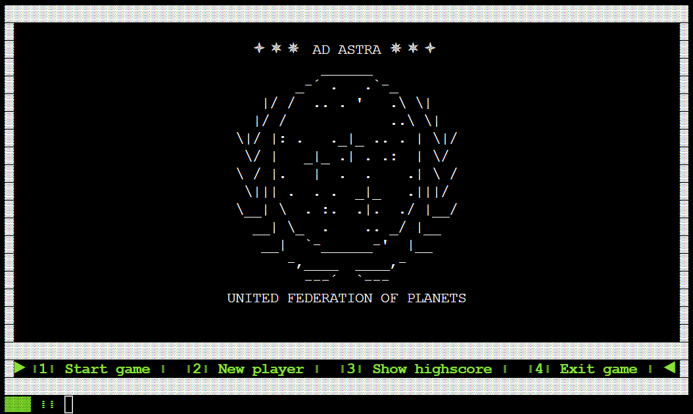
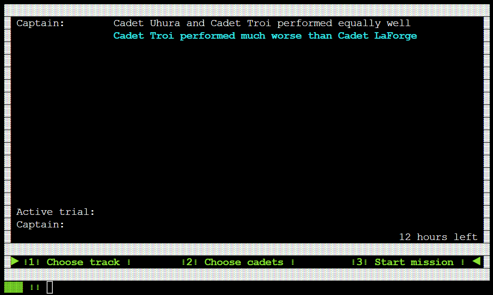
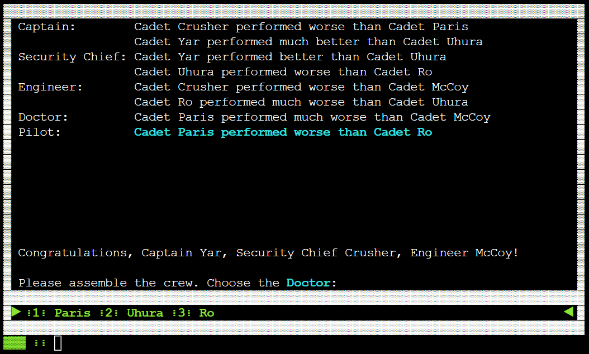
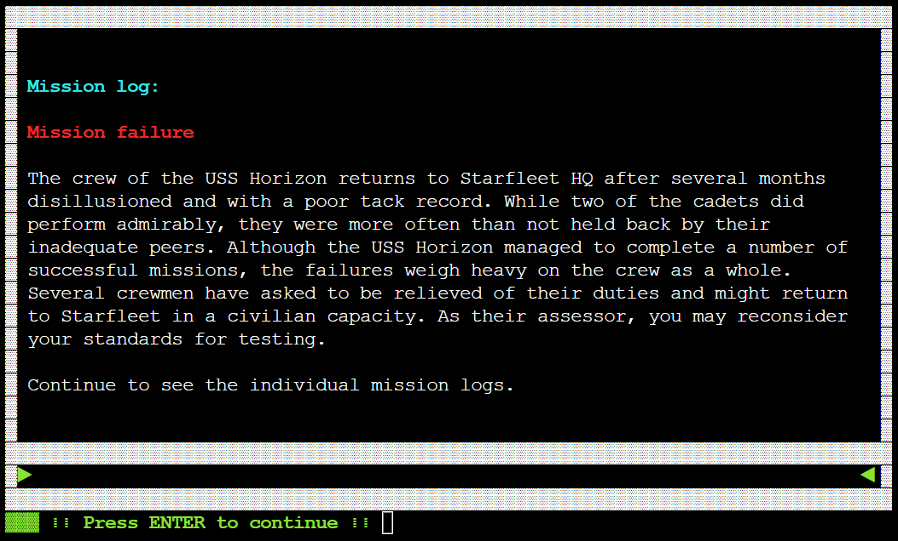
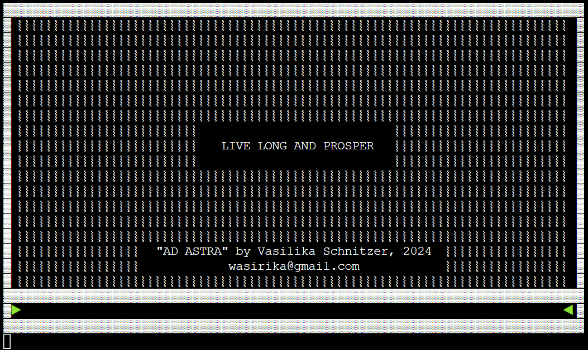
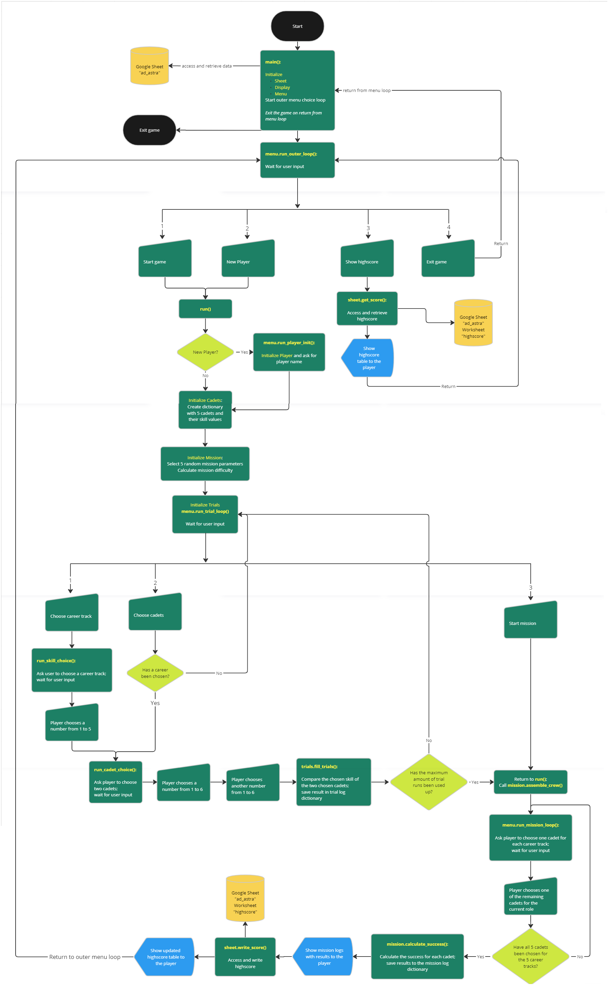
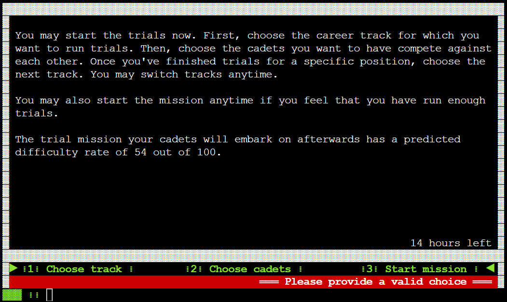

# Ad Astra
### A "Star Trek"-themed logic puzzle
---

[Live link to the game](https://ad-astra-42d5dff1b7ca.herokuapp.com/)

"Ad Astra" is a single-player game written in Python and playable in a Python terminal. It contains a text-based logic puzzle in which the player has to assemble a starship crew of five Starfleet cadets, filling each role on the crew with the cadet with the highest possible skill. The player determines cadet skill levels by comparing two cadets at a time and interpreting the textual hints to figure out which cadet is best suited for which role.

## Table of contents

Contents

- [UX](#ux)
  - [Target audience](#target-audience)
  - [User stories](#user-stories)
- [Design](#design)
  - [Color scheme](#color-scheme)
  - [Typography](#typography)
  - [Images](#images)
- [Features](#features)
  - [Planning](#planning)
  - [Game loop](#game-loop)
  - [Codebase](#codebase)
    - [File structure](#file-structure)
    - [Flowchart](#flowchart)
    - [Mechanics](#mechanics)
  - [Future features](#future-features)
  - [Known bugs](#known-bugs)
- [Technologies](#technologies)
  - [Main Languages](#main-languages)
  - [Dependencies and Imports](#dependencies-and-imports)
  - [Frameworks, Libraries, Applications](#frameworks-libraries-applications)
- [Testing](#testing)
- [Deployment](#deployment)
- [Credits](#credits)

## UX

### Target audience

The target audience are English-speaking players of all ages who are enthusiastic about text-based games, logic puzzles, and SciFi (mainly Star Trek).

The goal is to engage the player in a fun logic puzzle, encouraging them to play several playthroughs and break the highscore record or to at least read as many entertaining descriptions of how their cadets succeeded or failed as possible.

### User stories

1. As a player, I want to be able to easily understand how to start the game.
2. As a player, I want to be able to quickly understand what the game is about.
3. As a player, I want to be notified if my entry or menu choice is invalid.
4. As a player, I want to receive instant feedback when entering my choice.
5. As a player, I want to be receive feedback to let me know how well I did in the game.
6. As a player, I want to see how well I did compared with other players.

## Design

Since the game is written for a Python terminal, my design choices were rather limited: the terminal dimensions were set to 24 rows high and 80 characters wide by the template that Code Institute provided. I decided to write a Display class that would format and render all in- and output:
- All output is surrounded by an unchanging border built from the Unicode character "▓".
- The input is always prefaced with the decorative line "▓▓▓ ⁞⁞ ".
- Every new screen view overwrites the previous view, thereby making sure the player cannot scroll through previous output, which makes the game UI neat and clean.
- The menu row, the error row and the input row are always in the same place in every screen view, making it easier for the player to find the relevant information.

Since the terminal window is embedded in an HTML page, I adjusted the style of the HTML page to make it consistent with my game UI: the terminal is centered on the page and the page background color is black.

### Color scheme

I left the default colors for most of the output and used ASCII color codes to emphasize certain text:

- Black: background color
- White: most text
- White text on red background: error line
- Bright green text: menu line, "Mission success" notifications
- Bright red text: "Mission fail" notifications
- Bright cyan text: emphasis of updated information 

### Typography

I used the default font of the Python terminal for all text.

### Art

I used ASCII art to spice up the game visually:
- the Star Trek emblem of "United Federation of Planets" for the game start screen
- the ship "Ambassador Class (USS Excalibur NCC-26517)" for the flying ship animation before the mission phase of the game

[Link to the ASCII art website](https://ascii.co.uk/art/startrek)

## Features

### Planning

During the planning phase, I went through various game ideas before settling on this text-based logic puzzle. Once I had a basic idea of the required stages of the game, [I added comments to the run.py file](https://github.com/RikaIljina/PortfolioProject3/blob/5ef1590f7d6123a4a3424b692ca804a397b97809/run.py), roughly outlining the stages, functions, and classes I had to write. From there, I organically built up the script, first writing the basic logic to test the game principle, then adding the specific classes as needed and delegating certain processes to them.

In hindsight, I realize I should have planned out each class and each method beforehand to avoid rewriting and restructuring my code over and over to adapt to each new addition—for example, after adding the Display class, I had to replace each `print()` statement with the appropriate Display method to properly render all text on screen; later, after adding the Sheet class that uses Google Sheets as a text database, I had to move all hard-coded strings to a Google Worksheet, create message IDs, and pass the appropriate Sheet method with the relevant ID to the Display object to retrieve the text from the database. Had I written these helper classes before diving right into the game mechanics, I would have saved myself a lot of time and bug-chasing. However, when starting this project, I did not have a clear enough grasp on the coding challenges before me to foresee the project requirements and to plan ahead.

### Game loop

After the Heroku app has loaded, the player is presented with a terminal in which a screen reveal animation plays. After the animation, the player sees the game screen and the choices of the outer menu. Now the player can start to interact with the game.
The menu choices are entered via keyboard and confirmed with ENTER.

1. To play the game, the player chooses '1'.
2. The player is presented with an info screen explaining the game and prompting them to enter their name.
3. After a personalized greeting and a description of the next step, the player sees a menu where they can
   1. Choose a career track,
   2. Choose two cadets,
   3. Start the mission.
4. If the player chooses the first option, they are presented with a new menu line where they choose one of five roles (Captain, Security Chief, Engineer, Doctor, Pilot) by entering the appropriate number.
5. The player is then presented with a new menu line containing the six enumerated cadet names.
6. The player successively selects two names and reads the result of the comparison in the terminal.
7. The player is returned to point 3 where they can choose new cadets, choose a different track, or end the trial phase and start the mission right away.

8. Once the player has either run 14 trials or started the mission by entering '3' in the trials menu, they are presented with a menu consisting of the enumerated cadet names and prompted to choose one cadet per role. The results of the trial phase are displayed in the terminal to help the player make informed choices.

9. After assembling the crew, the player is presented with informative text and finally with the mission results for the entire mission as well as the individual cadet logs.

10. After reading the mission logs, the player sees their detailed score as well as the highscore table. The player is entered in the highscore table if their score is in the top 10 of all players.

11. The player is then returned to the first screen with the logo and the outer game menu choices where they can play another round, play as a new player with a different name, show the highscore again or exit the game. On exiting the game, the player is shown the credits, and the program ends.

### Codebase

#### File structure

- .devcontainer (from CI template)—directory with heroku config data
- controllers (from CI template)—directory with JS file which handles Python terminal creation and destruction
- views (from CI template)—directory with HTML and CSS data needed to style the webpage the terminal is embedded in
- index.js (from CI template)—Total.js start script
- package.json (from CI template)—JSON data file
- requirements.txt (from CI template)—external libraries that must be installed for the game to execute correctly on Heroku
- runtime.txt (from CI template)—Python version that the game uses on Heroku
- run.py—Python script that must be executed to start the game
- game—package with all modules accessed by run.py
  - components—package with game component modules:
    - cadets.py
    - player.py
  - phases—package with game phases modules:
    - mission.py
    - trials.py
  - UI—package with game UI modules:
    - display.py
    - menu.py
    - sheets.py
- assets/readme—directory with README-related files

#### Flowchart

Flowchart depicting the progression of actions and processes

#### Mechanics

**Dependencies:**

All game modules are imported and their classes instantiated in the main script file `run.py`. Since other game modules need access to each other to work correctly, I use dependency injection to pass object references from `run.py` to the modules during their class initialization.

**Database:**

The game uses a Google spreadsheet as a database. The spreadsheet is accessed with the help of the `gspread` module and my own API key.
The spreadsheet contains the highscore table that is read and updated every time the game is run.

The sheet also contains all messages that are shown to the user, paired with a unique message ID. All messages are loaded into a dictionary object at game start and read from there.

This approach helps avoid hard-coded texts and makes the game easily localizable.

**Reusability:**

The modules `sheets.py` and `display.py` have been written as independently from other the game modules as possible. Thus, `sheets.py` could be used for highscore management and text retrieval in a different Python console game, while `display.py` could be used for a different text-based game that requires a static terminal size with the same dimensions. A few hard-coded values would need to be replaced with variables to create a terminal with different dimensions.

**Error handling:**

Since the game handles user input, invalid inputs must be identified and prevented. All inputs are validated and in case of invalid input, a clear error message is shown to the player. The game then waits for valid input.

  

**Database and API issues**

A grave error that would make the game unplayable is a corrupted database. In case the spreadsheet with the data cannot be accessed or if the program tries to access a message with a key that does not correspond to an ID in the sheet, the game is terminated with an error message.

Preferably, the game would be tested enough times to see if all message IDs in the code correspond to the IDs in the Google sheet before deployment and after each update, so the user would never have to encounter any database errors. Also, the Google API key must be kept up to date to ensure the playability of the game.

### Future features

The following features could be implemented in future updates:

- [ ] Player name validation that prevents players from choosing an offensive name
- [ ] Implementation of a more extensive menu system that allows to return to main menu and exit the game at any point of the game and to return to the previous menu choices in case of making a wrong choice
- [ ] Localization of all strings to make the game available in other languages
- [ ] Implementation of game settings in the menu to change the language or the color scheme to make it more accessible
- [ ] Addition of sounds and music

### Known bugs

See the ["Bugs" section of TESTING.md](TESTING.md#known-bugs-and-persisting-issues) for bug descriptions.

## Technologies

### Main Languages

- Python 3.11.5

### Dependencies and Imports

- [gspread](https://docs.gspread.org/en/v6.0.0/): Python API for Google Sheets
- [google-auth](https://google-auth.readthedocs.io/en/stable/reference/google.oauth2.service_account.html) ('service-account' module): Google authentication library for Python
- [colorama](https://pypi.org/project/colorama/): makes ANSI escape character sequences work under MS Windows
- `sys`, `time`, `textwrap`, `re`, `typing`, `math`, `random`, `termios`, `msvcrt` from the [Python Standard Library](https://docs.python.org/3/library/index.html)

### Frameworks, Libraries, Applications

- [Git](https://git-scm.com/): version control via VS Code terminal
- [GitHub](https://github.com/): project storage and submission
- [Heroku](https://www.heroku.com/): project deployment
- [Google Sheets](https://docs.google.com/spreadsheets): database
- [VS Code](https://code.visualstudio.com/): IDE
- [Code Spell Checker](https://marketplace.visualstudio.com/items?itemName=streetsidesoftware.code-spell-checker): spell check extension for VS Code
- [Pylance](https://marketplace.visualstudio.com/items?itemName=ms-python.vscode-pylance): Language server for Python in VS Code
- [Pylint](https://marketplace.visualstudio.com/items?itemName=ms-python.pylint): VS Code extension providing linting support for Python files using `pylint`
- [autopep8](https://marketplace.visualstudio.com/items?itemName=ms-python.autopep8): VS Code extension providing formatting support for Python files using the `autopep8` formatter
- [autoDocstring](https://marketplace.visualstudio.com/items?itemName=njpwerner.autodocstring): generates Python docstrings automatically
- [pip-tools](https://github.com/jazzband/pip-tools): generates up-to-date requirement list with `pip-compile`

## Testing

Tests are described in [TESTING.md](TESTING.md).

## Deployment

### Pushing to GitHub

1. Login to [GitHub](https://github.com/) and create a new empty project repository
2. Create the local project in VS Code
3. Initialize the repository by opening a terminal in VS Code and entering the command  `git init --initial-branch=main`
4. Add all project files to the repository with the command `git add .`
5. Commit all added files with the command `git commit -m "Initial commit"`
6. Create new remote with the command `git remote add origin https://github.com/[UserName]/[RepoName].git`
7. Push the files to the remote repository on GitHub with the command `git push -u origin main`

### Heroku

The game was deployed to Heroku using [this template](https://github.com/Code-Institute-Org/p3-template) provided by Code Institute.
Deployment process:

1. Log in to Heroku using your GitHub account.
2. Open your dashboard and click on "New" > "Create new app".
3. Enter relevant data and click on "Create app".
4. In the tab row below the app name, click on "Settings".
5. In the section "Buildpacks", add the buildpack `heroku/python`.
6. Then add the buildpack `heroku/nodejs` (Note: the order in which the buildpacks are added is important!).
5. In the section "Config Vars", click on "Reveal Config Vars".
7. Create a config var called `PORT` and set it to `8000`.
8. If you are using an API such as the Google Sheet API, add the following config var: use the key `CREDS` and paste the contents of your API credentials file `creds.json` into the `value` field.
9. In the tab row below the app name, click on "Deployment".
10. In the section "Deployment Method", click on "GitHub".
11. In the section below, enter the repository name of the project that will be deployed.
    - Make sure that the repository contains an up-to-date `requirements.txt` file with all installed packages in your Python environment. To create it, execute `pip freeze > requirements.txt` in your code editor with the project open.
    - Make sure that the repository contains a `runtime.txt` file with the Python version that the project uses to run (e.g. python-3.11.5).
12. Once the repository is found, click on "Connect".
13. In the section below, enable automatic deployments to automatically deploy to Heroku after each push to GitHub (if needed).
14. In the section below, click on "Deploy branch".
15. Once the deployment process is finished, click on "View" at the bottom of the page or on "Open app" at the top of the page to open the live app.
10. The live link can be found [here](https://ad-astra-42d5dff1b7ca.herokuapp.com/).

### Generating Google API credentials

The game uses the Google API to connect the Python script to Google Sheets. To issue an API key:

1. Log into [Google Cloud](https://console.cloud.google.com/apis/library) and open your console by clicking on "Console".
2. In the upper part of the page, click on "Select a project" > "New Project".
3. Choose a project name and click on "Create".
4. Click on the notifications icon and then on "Select project".
5. Open the burger menu to the right and select "APIs & Services" > "Library".
6. Find and enable "Google Drive API".
7. On the next page, with the section "Enabled APIs & services" open and "Google Drive API" selected, click on "Create credentials".
8. From the "Which API are you using?" dropdown menu, choose "Google Drive API".
9. For the "What data will you be accessing?" question, select "Application Data" and click on "Next".
10. Enter a name for the service account (such as "MyGreatProject") and click on "Create and continue".
11. Under "Grant this service account access to project" choose "Basic" > "Editor", then click on "Continue" and finally on "Done".
12. On the next page, open the section "Credentials" and click on the link with the service account name in the table "Service accounts".
13. On the next page, click on the "Keys" tab.
14. Click on "Add key" > "Create new key" and select "JSON" as the key type.
15. The key file is downloaded to your Download folder. It can now be moved into your Python project folder, renamed, and accessed with `gspread`.
    >$\color{red}{\textsf{Important!}}$ The credentials file must be kept secret. To prevent it from being uploaded to your GitHub repository, its name must be added to the repo's `.gitignore` file.
16. Return to the API Library and find and enable "Google Sheets API".
17. Return to the section "Credentials" and copy the service account email in the table "Service accounts".
18. Open the Google Worksheet you want to connect to the Python script and share it with the service account by pasting in the email address and giving it the role of "Editor".

### Forking the GitHub Repository

By forking the GitHub Repository, you can make a copy of the original repository in your GitHub account. There, you can view and/or make changes to the repo without affecting the original.

1. Log in to GitHub and locate the GitHub Repository.
2. At the top of the Repository (not top of page), to the right of the repository name, locate the "Fork" button.
3. You should now have a copy of the original repository in your GitHub account.

### Making a Local Clone

1. Log in to GitHub and locate the GitHub Repository.
2. At the top of the Repository, click on the "<> Code" button.
3. To clone the repository using HTTPS, copy the link under "HTTPS".
4. Open Git Bash or the VS Code terminal.
5. Change the current working directory to the location where you want the cloned directory to be made.
6. Type `git clone`, and then paste the URL you copied in Step 3.
7. Press Enter. Your local clone will be created.

## Credits

### Code used

All Python code was written by me unless clearly stated otherwise.

Beside the Code Institute learning materials and sample files, I also used the following reference materials:

- [Python docs](https://docs.python.org/)
- [W3 Schools](https://www.w3schools.com/js/default.asp)
- [Stackoverflow](https://stackoverflow.com/)
- [YouTube video on avoiding bad coding habits in Python](https://www.youtube.com/watch?v=qUeud6DvOWI)
- [YouTube video on Python code style tips](https://www.youtube.com/watch?v=woIkysZytSs)

### Content

All texts have been written by me or by my sister.

### Media

I used Star Trek-themed ASCII art that can be found online:

[Link to the ASCII art website](https://ascii.co.uk/art/startrek)

### Acknowledgments

- Many thanks to my sister for writing most of the descriptive in-game texts.
- Many thanks to my mentor for constructive feedback.
- Many thanks to friends and family who did a lot of testing.
- Many thanks to the Code Institute slack community for constant and general support.
- This game is based on the [Star Trek](https://www.startrek.com/en-un) universe, which is copyrighted and owned by [Paramount](https://www.paramount.com/). The usage of names, characters, and references from Star Trek is for non-commercial, educational purposes under the fair use regulation. I do not claim any ownership of the Star Trek franchise or its associated intellectual property.
