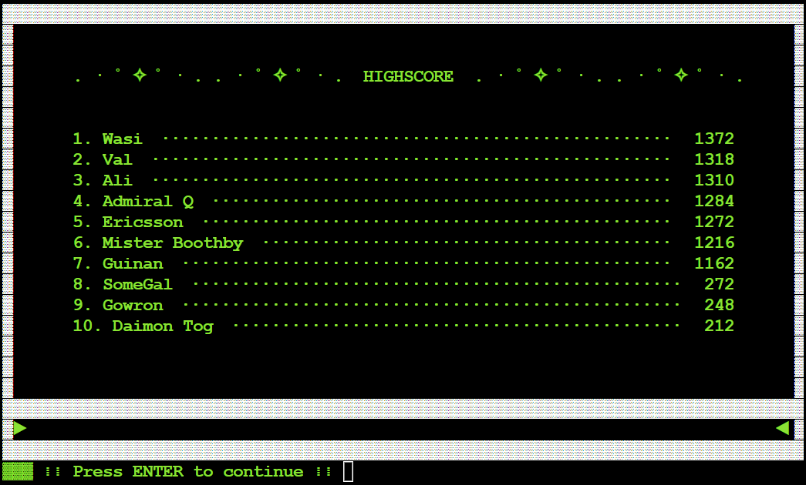

# Ad Astra
### A "Star Trek"-themed logic puzzle
---

[Live link to the game](https://rikailjina.github.io/PortfolioProject2/)

"Ad Astra" is a single-player game written in Python and playable in a Python terminal. It contains a text-based logic puzzle in which the player has to assemble a starship crew of five Starfleet cadets, filling each role on the crew with the cadet with the highest possible skill. The player determines cadet skill levels by comparing two cadets at a time and interpreting the textual hints to figure out which cadet is best suited for which role.

## Table of Contents

- [UX](#ux)
  - [Target audience](#target-audience)
  - [User stories](#user-stories)
- [Design](#design)
  - [Color scheme](#color-scheme)
  - [Typography](#typography)
  - [Images](#images)
- [Features](#features)
  - [Game loop](#game-loop)
  - [Codebase](#codebase)
    - [File structure](#file-structure)
    - [Flowchart](#flowchart)
    - [Mechanics](#mechanics)
  - [Future features](#future-features)
  - [Known bugs](#known-bugs)
- [Technologies](#technologies)
  - [Main Languages](#main-languages)
  - [Frameworks, Libraries, Applications](#frameworks-libraries-applications)
- [Testing](#testing)
- [Deployment](#deployment)
- [Credits](#credits)

## UX

### Target audience

The target audience are English-speaking players of all ages who are enthusiastic about text-based games, logic puzzles, and SciFi (mainly Star Trek).

The goal is to engage the player in a fun logic puzzle, encouraging them to play several playthroughs and break the highscore record or to at least read as many entertaining descriptions of how their cadets succeeded or failed as possible.

### User stories

1. As a player, I want to be able to easily understand how to start the game.
2. As a player, I want to be able to quickly understand what the game is about.
3. As a player, I want to be notified if my entry or menu choice is invalid.
4. As a player, I want to receive instant feedback when entering my choice.
5. As a player, I want to be receive feedback to let me know how well I did in the game.
6. As a player, I want to see how well I did compared with other players.

## Design

Since the game is written for a Python terminal, my design choices were rather limited: the terminal dimensions were set to 24 rows high and 80 characters wide by the template that Code Institute provided. I decided to write a Display class that would format and render all in- and output:
- All output is surrounded by an unchanging border built from the Unicode character "▓".
- The input is always prefaced with the decorative line "▓▓▓ ⁞⁞ ".
- Every new screen view overwrites the previous view, thereby making sure the player cannot scroll through previous output, which makes the game UI neat and clean.
- The menu row, the error row and the input row are always in the same place in every screen view, making it easier for the player to find the relevant information.

Since the terminal window is embedded in an HTML page, I adjusted the style of the HTML page to make it consistent with my game UI: the terminal is centered on the page and the page background color is black.

### Color scheme

I left the default colors for most of the output and used ASCII color codes to emphasize certain text:

- Black: background color
- White: most text
- White text on red background: error line
- Bright green text: menu line, "Mission success" notifications
- Bright red text: "Mission fail" notifications
- Bright cyan text: emphasis of updated information 

### Typography

I used the default font of the Python terminal for all text.

### Art

I used ASCII art to spice up the game visually:
- the Star Trek emblem of "United Federation of Planets" for the game start screen
- the ship "Ambassador Class (USS Excalibur NCC-26517)" for the flying ship animation before the mission phase of the game

[Link to the ASCII art website](https://ascii.co.uk/art/startrek)

## Features

### Game loop

After the Heroku app has loaded, the player is presented with a terminal in which a screen reveal animation plays. After the animation, the player sees the game screen and the choices of the outer menu. Now the player can start to interact with the game.
The menu choices are entered via keyboard and confirmed with ENTER.

1. To play the game, the player chooses '1'.
2. The player is presented with an info screen explaining the game and prompting them to enter their name.
3. After a personalized greeting and a description of the next step, the player sees a menu where they can
   1. Choose a career track,
   2. Choose two cadets,
   3. Start the mission.
4. If the player chooses the first option, they are presented with a new menu line where they choose one of five roles (Captain, Security Chief, Engineer, Doctor, Pilot) by entering the appropriate number.
5. The player is then presented with a new menu line containing the six enumerated cadet names.
6. The player successively selects two names and reads the result of the comparison in the terminal.
7. The player is returned to point 3 where they can choose new cadets, choose a different track, or end the trial phase and start the mission right away.

8. Once the player has either run 14 trials or started the mission by entering '3' in the trials menu, they are presented with a menu consisting of the enumerated cadet names and prompted to choose one cadet per role. The results of the trial phase are displayed in the terminal to help the player make informed choices.

9. After assembling the crew, the player is presented with informative text and finally with the mission results for the entire mission as well as the individual cadet logs.

10. After reading the mission logs, the player sees their detailed score as well as the highscore table. The player is entered in the highscore table if their score is in the top 10 of all players.

11. The player is then returned to the first screen with the logo and the outer game menu choices where they can play another round, play as a new player with a different name, show the highscore again or exit the game. On exiting the game, the player is shown the credits, and the program ends.

### Codebase

#### File structure

- 

#### Flowchart

Flowchart depicting the progression of actions and processes

#### Mechanics

**Call stack:**

**Dependencies:**

**Message database:**

**Error handling:**

**Input issues**

Since I allow direct user input of a string on my website, I need to make sure that the user doesn't input anything malicious or anything that could break the readability of the page text. 

**Database issues**

A grave error that would make the game unplayable is a corrupted database. 

Preferably, the integrity of the file ` ` would be tested and ascertained before deployment and after each update, so the user would never have to encounter any of those database errors.

### Future features

The following features could be implemented in future updates:

- [ ] Localization of all strings to make the game available in other languages

### Known bugs

See the ["Bugs" section of TESTING.md](TESTING.md#known-bugs) for bug descriptions.

## Technologies

### Main Languages

- Python 3.11.5

### Frameworks, Libraries, Applications

- [Git](https://git-scm.com/): version control via VS Code terminal
- [GitHub](https://github.com/): project storage and submission
- Chrome DevTools: debugging and responsiveness checks
- [Google Fonts](https://fonts.google.com/): all site fonts
- [Google Sheets](https://): database
- [Flaticon](https://www.flaticon.com/): free graphics
- [WebAIM](https://webaim.org/resources/contrastchecker/): contrast check
- [amiresponsive](https://ui.dev/amiresponsive): responsiveness mock-up
- VS Code: IDE
- [OpenAI ChatGPT](https://openai.com/): help with creating quiz questions
- [Code Spell Checker](https://marketplace.visualstudio.com/items?itemName=streetsidesoftware.code-spell-checker): spell check extension for VS Code

## Testing

Tests are described in [TESTING.md](TESTING.md).

## Deployment

### Pushing to GitHub

1. Login to GitHub.com and create a new empty project repository
2. Create the local project in VS Code
3. Initialize the repository by opening a terminal in VS Code and entering the command  `git init --initial-branch=main`
4. Add all project files to the repository with the command `git add .`
5. Commit all added files with the command `git commit -m "Initial commit"`
6. Create new remote with the command `git remote add origin https://github.com/[UserName]/[RepoName].git`
7. Push the files to the remote repository on GitHub with the command `git push -u origin main` 

### Heroku
### GitHub Pages

The website was deployed to GitHub Pages. Deployment process:

1. Login to GitHub.com and open project repository
2. Click on "Settings"
3. In the left panel, select "Pages"
4. Under "Build and Deployment" - "Source", select "Deploy from a branch" and select the main branch
5. Once the deployment is finished, the link to the page is shown at the top of the GitHub Pages section
6. The live link can be found [here](https://rikailjina.github.io/PortfolioProject2/)

### Forking the GitHub Repository

By forking the GitHub Repository, you can make a copy of the original repository in your GitHub account. There, you can view and/or make changes to the repo without affecting the original.

1. Log in to GitHub and locate the GitHub Repository.
2. At the top of the Repository (not top of page), to the right of the repository name, locate the "Fork" button.
3. You should now have a copy of the original repository in your GitHub account.

### Making a Local Clone

1. Log in to GitHub and locate the GitHub Repository.
2. At the top of the Repository, click on the "<> Code" button.
3. To clone the repository using HTTPS, copy the link under "HTTPS".
4. Open Git Bash or the VS Code terminal.
5. Change the current working directory to the location where you want the cloned directory to be made.
6. Type `git clone`, and then paste the URL you copied in Step 3.
7. Press Enter. Your local clone will be created.

## Credits

### Code used

All code was written by me unless clearly stated otherwise.

Beside the Code Institute learning materials and sample files, I also used the following reference materials:

- [MDN web docs](https://developer.mozilla.org/en-US/docs/Web/JavaScript)
- [W3 Schools](https://www.w3schools.com/js/default.asp)
- [Stackoverflow](https://stackoverflow.com/)

### Content

Written by

### Media

ASCII art

### Acknowledgments

- Many thanks to my mentor for constructive feedback.
- Many thanks to friends and family who did some of the testing.
- Many thanks to the Code Institute slack community for constant and general support.
