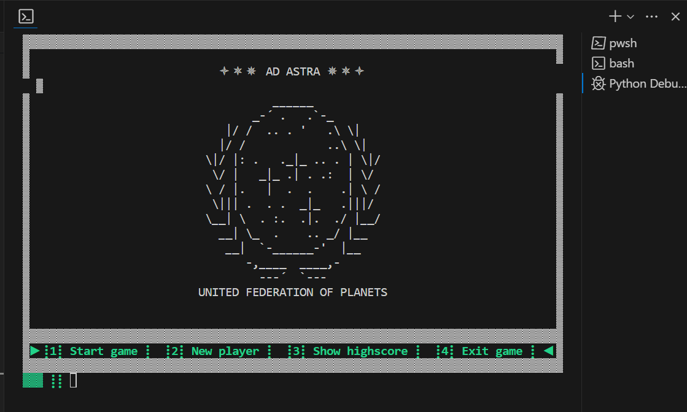

# "AD ASTRA" - Testing

## CONTENTS

- [MANUAL TESTING](#manual-testing)
  - [Testing User Stories](#testing-user-stories)
  - [Full Testing](#full-testing)
- [BUGS](#bugs)
  - [Solved bugs](#solved-bugs)
  - [Known bugs and persisting issues](#known-bugs-and-persisting-issues)

## Manual Testing

### Testing user stories

| Goal | How is it achieved? |
|---|---|
| As a player, I want to easily understand how to start the game, so I can begin playing without confusion or delay. | Players are greeted by a loading screen with a clear and intuitive menu line which contains the option "Start game" along with the associated number to enter. |
| As a player, I want to quickly grasp the concepts and objectives of the game, so I can engage with it effectively. | After starting the game, a one-page description is shown to the player explaining how the game works and what the objective is. |
| As a player, I want to be notified immediately if my entry or menu choice is invalid, so I can correct errors and have a smooth gaming experience. | A highlighted error line is shown whenever the player enters invalid input, prompting them to make an appropriate selection. |
| As a player, I want to receive instant feedback when entering my choice, so I can understand the consequences of my decisions. | Feedback is given in the form of changing screens and appropriate info texts, letting the player see the outcome of their actions. |
| As a player, I want to receive feedback about how well I did in the game, so I can adapt my strategy on the next playthrough. | After each playthrough, the player is shown a score table detailing the points they achieved or lost. |
| As a player, I want to see how well I did compared with other players, so I am motivated to improve my playing style. | After each playthrough, the game checks whether the player's score is high enough to be entered into the highscore. The highscore table with player names and top scores is shown to the player. |

### Full Testing

The website was tested on:
 - Laptop: 
    - HP EliteBook x360 1030 G3 13.3'', Windows 11 Pro

  Due to the unresponsiveness of the embedded Python terminal, the game is not suitable for mobile phones.

On the laptop, the site was tested in the following browsers:
 - Chrome
 - Opera
 - Microsoft Edge

The following goals were thoroughly tested:

| Goal | Result |
|---|---|
| There are no spelling errors in the game | Pass |
| The player name input prompt accepts only the allowed character set | Pass |
| All menu choices lead to the correct screen or start the correct function | Pass |
| No printed lines are longer than the terminal rows; long imported lines are wrapped correctly | Pass |
| All texts intended for one screen view fit into the terminal without breaking the borders | Pass |
| All colors are displayed correctly | Pass |
| In case of invalid input, the error handling functionality kicks in and notifies the player about the nature of the error | Pass |
| In case of database errors, the error handling functionality kicks in and notifies the player about the nature of the error | Pass |
| The code conforms to the PEP8 style guide | Pass |
| The code doesn't contain unexplained issues that a linter would detect | Pass |

The code has been checked and corrected with the help of the VS code extensions `autopep8` and `Pylint`.

## Bugs

### Solved bugs

The following issues came up during the development or testing process and were fixed:

| Issue | Fix |
|---|---|
| During development, I had several bugs because I did not take into consideration that Python interprets the number 0 and empty strings as `False`. Certain values would not be shown and functions would not be triggered because of that. | I partly converted `0` to a string, partly rephrased my `if`-statements to say `if x is None:` instead of `if x:` to solve the bugs. |
| When implementing the Display module, I noticed that my screen was being redrawn too often, even when invisible to the player. | I discovered that I was calling it from within my `build_screen()` method which is only supposed to assemble the terminal into a drawable list. I made sure to only call the `draw()` method when it is relevant to the player: whenever the input prompt is shown or when the `time.sleep()` function is used to create screen changes without needing user input. |
| When using `time.sleep()`, the player could type something on the keyboard that would then be visible in the input prompt. | I found a code snippet on [stackoverflow](https://stackoverflow.com/questions/67083097/how-to-prevent-user-input-into-console-when-program-is-running-in-python) that flushes the input stream under Windows and Linux.|
| I'm using ANSI escape sequences to add color to my game. However, I encountered issues due to the specific process I use to build my screen: the length of the string must be considered when fitting it into 80 columns and surrounding it with border elements. If an ANSI sequence is present, it adds to the string length despite being invisible, thus disrupting the screen output. | Whenever an ANSI sequence is present in a string, a certain amount of characters must be added to the total row width to achieve the correct result. Trial and error has shown that 11 characters must be added when an ANSI color code and an ANSI reset code are present. It works to properly build the screen, but I have not yet found out why it must be precisely 11. |
| The player could break the terminal display by entering a long sequence spanning more than two rows into the prompt. While the input was ignored by the game as invalid, its presence in the terminal added extra rows and made the whole terminal scrollable, showing broken parts of the previous screen. | I was unable to find a way to limit the length of the input itself, but I found a way to clear the terminal more thoroughly than with cls/clear: `print('\033c', end='')`. Now, the terminal doesn't show parts of previous output even if the user enters too many lines. Since a benchmark test with `time.perf_counter()` showed that this function is much faster than `os.system("clear")`, I replaced the latter with the former in all my modules. |
| In my attempt to incorporate animations in the Python console without using complex external libraries that might not work with Heroku, I resorted to very basic mechanics: the screen output is being built out of 23 rows that are being assembled from a list, which is then being printed on screen with a short delay between the printing cycles. That way, the logo reveal animation and the flying ship animation are achieved. However, these processes rely heavily on `for`-loops and the constant re-drawing of the screen, which is not very performant and causes a lot of unpleasant flickering. | Given more time, I would find better ways to implement such animations by using external libraries or refactoring the animation functions. For now, I've used `print('\033[1;1H', end='')` to move the cursor to the beginning of the terminal before each new animation frame instead of clearing the screen. The new frame simply overwrites the previous frame, thus reducing the flickering. |
| When first deploying my project on Heroku, I got a `SyntaxError` for using `match`. | I found out that `match` statements were not supported before Python 3.10 and that my Python version (python-3.11.5) did not match the version in the `runtime.txt` file (python-3.9.18). I changed the version in the file to my own version, which solved the error. |

### Known bugs and persisting issues

- The game mechanics and the score calculation are not well-balanced yet:
  - The cadet skill values are being randomly chosen from a pool of 25 points per cadet, but it is not a given that every cadet gets a skill with 10 points. This makes it impossible for the player to find a guaranteed way of achieving a top score in every playthrough.
  - The score calculation needs to be tested more thoroughly to produce a fair result.
- I am not sure whether the `flush_input()` function will work on all systems to flush the input stream.
- I have no insight into how exactly Unicode characters are rendered by the Python terminal embedded in an HTML page. Therefore I am not sure whether all Unicode characters that I use for decoration will be shown correctly by all browsers and on all systems.
- I wanted to have all my texts accessible and editable from outside the code, which is why I used Google Sheets as a database from which I retrieve all text by ID. While my solution works within the scope of this small game, there is still the risk of misspelling an ID for dictionary lookup and causing an error in the game. For larger projects I would probably use the `gettext` module to prevent such issues and have more features such as the consideration of plural forms.
- Even though I tried to avoid hard-coding values, I still have several that mostly pertain to text-length calculations and row amounts. These should be fixed to make the code more maintainable.
- When testing the game in my IDE, one line sometimes appears broken when the preview window is just wide enough to fit the output: 

  I believe this happens because of the Unicode 'star' characters that I use around 'AD ASTRA' - some of them seem to take up more than just one space. Since this issue hasn't shown up outside of the IDE, I haven't tried to fix it yet.